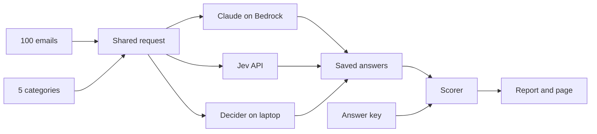

# Technical approach

Four models sort the same 100 CRM emails into 5 categories; we score each against one answer key on accuracy, speed and cost.

## How it works

1. Each email is sent to one model at a time, and every answer is saved the moment it arrives.
2. The scorer compares the saved answers with the answer key and writes the report.

## Every model gets the same input

Three things go to every model: the email, the question, and the 5 categories with their descriptions.
Only the packaging differs, because each kind of model expects a different shape.

| Model | How the three things are sent |
|---|---|
| Claude Opus, Sonnet | One written prompt: instructions plus categories, then the email. It replies with one category name. |
| Jev, Strands Decider | Three fields: the email as `state`, the question as `instructions`, the categories as `criteria`. |

The answer key (`data/labels.jsonl`) is never sent to any model.

## No examples, no training data

No model gets sample emails or "seed data"; every model answers cold. This is called zero-shot.
Jev and Decider do not need examples: their docs say to send the options with clear descriptions, which we do.

- The category descriptions in `data/categories.json` are the only guidance, and every model sees the same text.
- If we ever add examples, they go into those descriptions so all four models get them equally.

## Why a model misses

A miss means the model judged the email differently, not that it got a different input. One sample:

> e004, "Can your pipelines track a lead from first visit to signed contract? Would love to see it in action."

The key says `new_lead`. Decider said `partner_vendor` with confidence 0.42, which means it was unsure.
Decider is a small 2-billion-parameter model on a laptop processor, so it is expected to miss more than Claude.

## How results are scored

- Accuracy: answers that match the key, divided by emails answered.
- Speed: time per email, as an average and the 95th percentile (the slow tail).
- Cost: tokens times each provider's list price. Decider is free because it runs locally.
- Anything that is not a category name (a refusal, an error, a cut-off reply) counts as wrong.

## Choices we made

- No fallback to another model when one refuses: a stand-in model would blur the comparison.
- Claude goes through the Bedrock runtime with `us.` model names, because the newer endpoint did not know these models in our account.
- Decider runs as a local server that speaks Jev's API, so both decision models get identical requests apart from the model name.
- The answer key was written by Claude (Opus 5.5), so it may lean towards Claude; a human spot-check is still open.

## Prompt round 2 (2026-10-06)

The first full runs showed three misses that traced to our wording, not to the models:
a vendor promo read as spam, a vendor's "custom quote" read as a lead, and Sonnet replied "Who is writing?".

- The category descriptions now say who is buying: a lead wants to buy from us, a vendor wants to sell to us.
- `not_crm` is now the explicit catch-all, and the prompt says never to reply with a question.
- Every model gets the new wording, so all four were rerun; round-1 numbers are not comparable.
